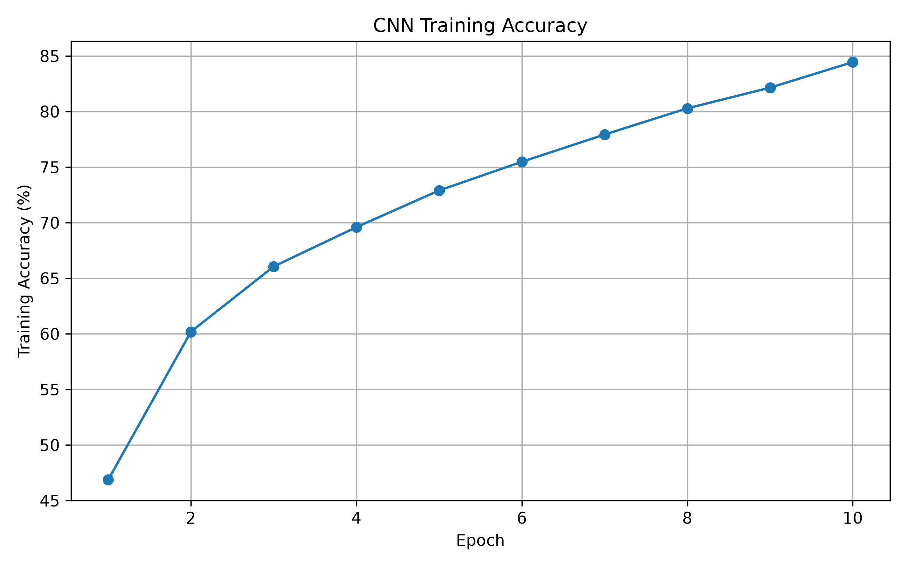
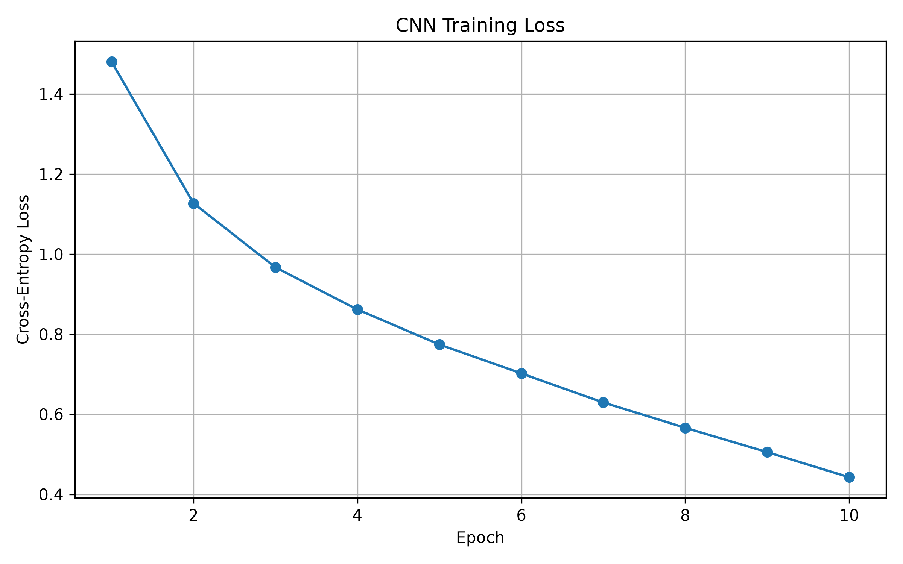
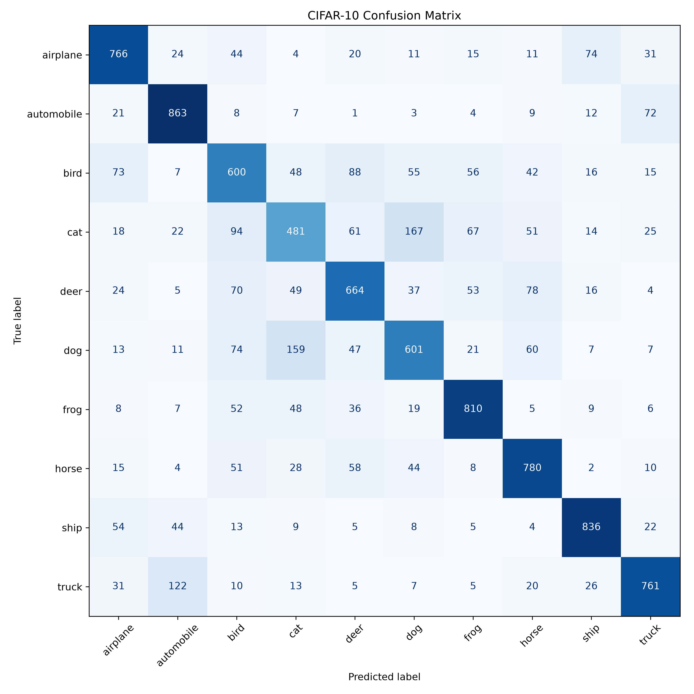
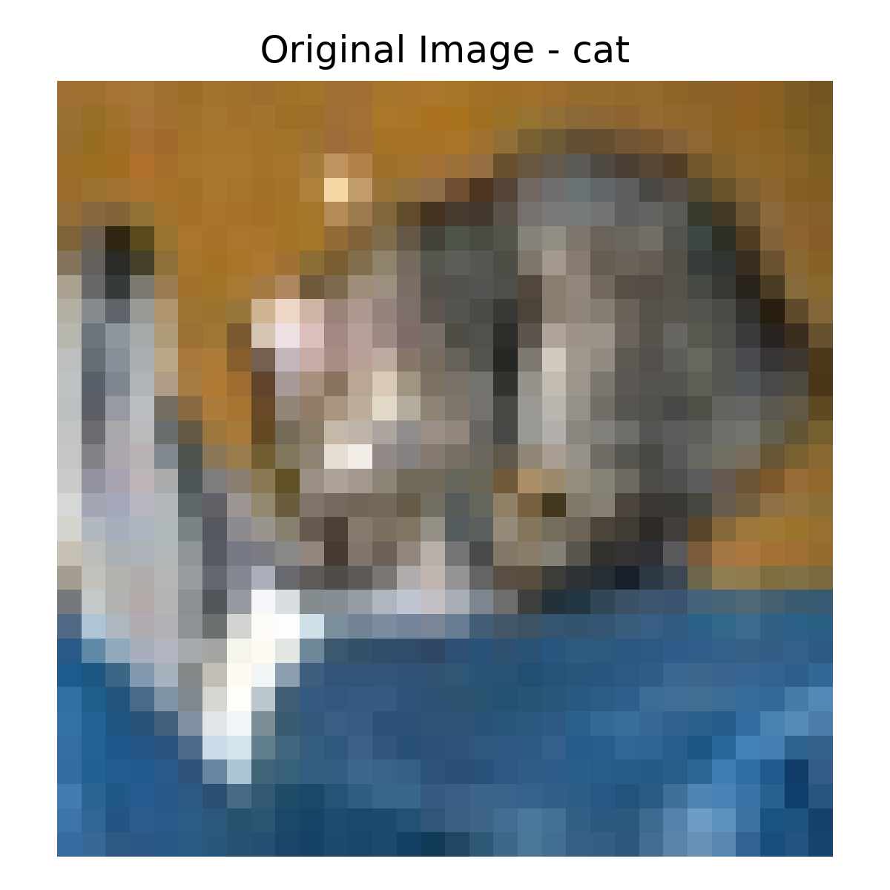
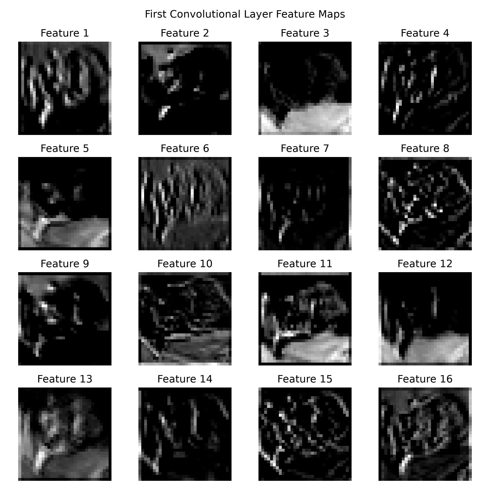
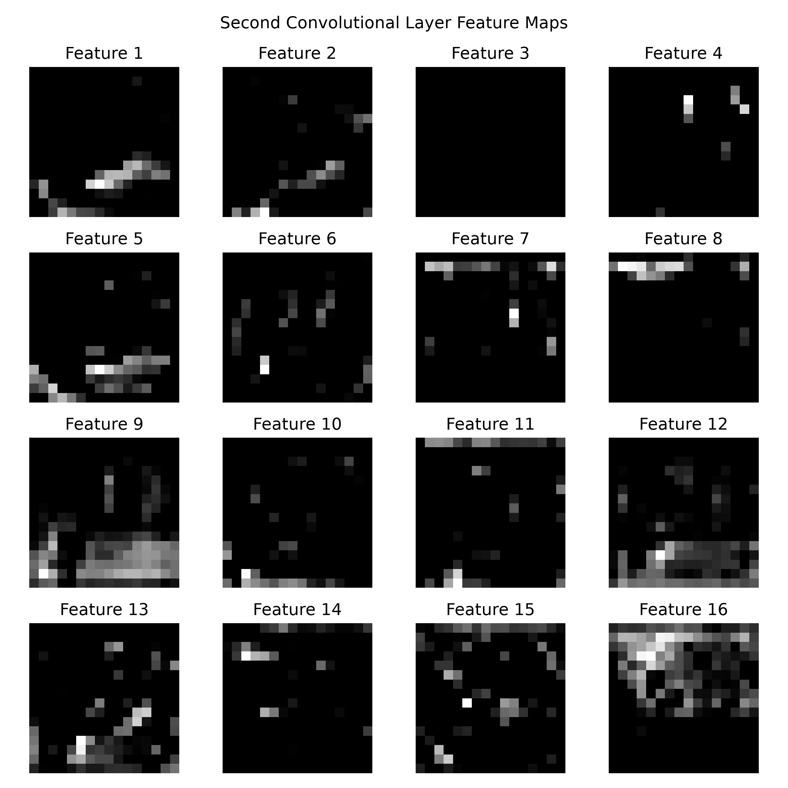
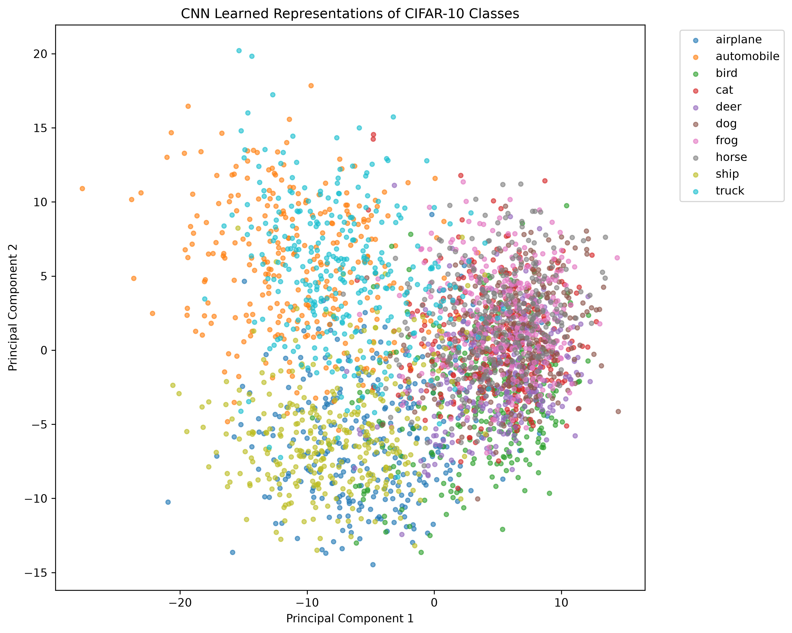
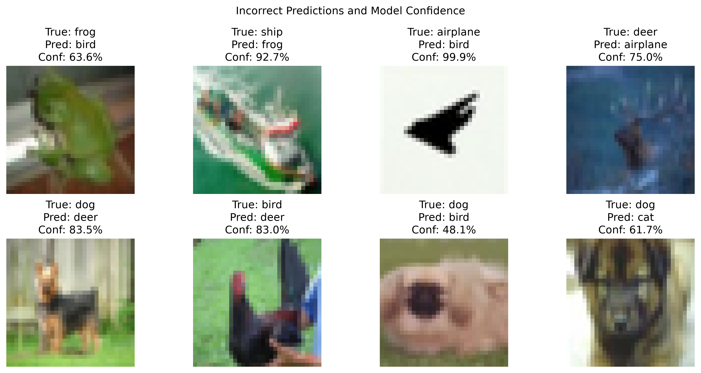
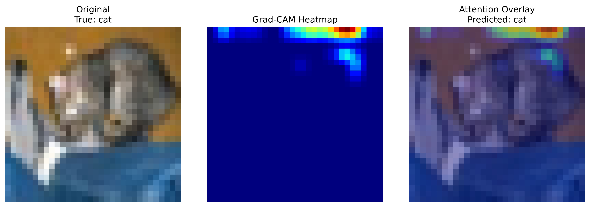
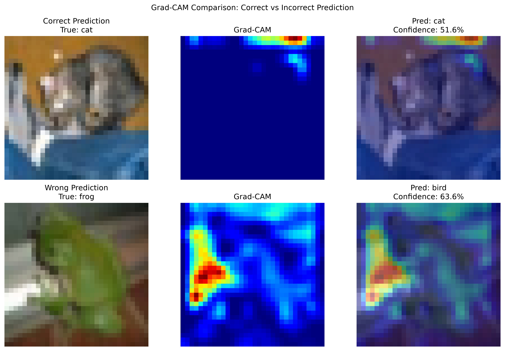

# Visual Representation Analysis in Convolutional Neural Networks

### Understanding How Convolutional Neural Networks Learn, Transform, and Use Visual Features

This project studies what happens **inside a Convolutional Neural Network (CNN)** while it learns to classify natural images.

Instead of focusing only on final classification accuracy, the project investigates:

- how visual features evolve through convolutional layers,
- how CIFAR-10 classes are organized in learned representation space,
- which classes are confused,
- whether incorrect predictions can still have high confidence,
- and which image regions influence CNN decisions using Grad-CAM.

The main goal is to move beyond:

> "How accurate is the model?"

toward:

> "What visual representations did the model learn, and how do those representations influence its decisions?"

---

## Dataset

The project uses the **CIFAR-10 dataset**, containing 10 natural-image categories:

- airplane
- automobile
- bird
- cat
- deer
- dog
- frog
- horse
- ship
- truck

Each image has size:

```text
3 × 32 × 32
```

which corresponds to:

```text
RGB channels × height × width
```

Dataset sizes:

```text
Training images: 50,000
Test images:     10,000
```

---

## CNN Architecture

The model uses a compact CNN architecture:

```text
Input
[3 × 32 × 32]

      ↓

Conv2D
3 → 32 channels
3 × 3 kernel

      ↓

ReLU

      ↓

MaxPool
32 × 32 → 16 × 16

      ↓

Conv2D
32 → 64 channels
3 × 3 kernel

      ↓

ReLU

      ↓

MaxPool
16 × 16 → 8 × 8

      ↓

Flatten

64 × 8 × 8
= 4096 features

      ↓

Linear
4096 → 128

      ↓

ReLU

      ↓

Linear
128 → 10 class logits
```

The convolutional layers learn spatial visual patterns, while the fully connected layers combine the learned features for classification.

---

## Training Configuration

The model was trained using:

```text
Optimizer:     Adam
Learning rate: 0.001
Batch size:    64
Epochs:        10
Loss:          Cross-Entropy Loss
```

GPU acceleration with PyTorch CUDA was used when available.

---

## Training Results

| Epoch | Training Loss | Training Accuracy |
|------:|--------------:|------------------:|
| 1 | 1.4807 | 46.87% |
| 2 | 1.1271 | 60.19% |
| 3 | 0.9670 | 66.06% |
| 4 | 0.8617 | 69.60% |
| 5 | 0.7743 | 72.90% |
| 6 | 0.7021 | 75.48% |
| 7 | 0.6294 | 77.93% |
| 8 | 0.5662 | 80.29% |
| 9 | 0.5054 | 82.15% |
| 10 | 0.4427 | 84.45% |

Final training results:

```text
Training Accuracy: 84.45%
Training Loss:     0.4427
Test Accuracy:     71.62%
```

Generalization gap:

```text
84.45% - 71.62%
= 12.83 percentage points
```





---

## Test Performance

The trained CNN was evaluated on 10,000 unseen CIFAR-10 test images.

```text
Correct predictions: 7162
Total test images:   10000
Test accuracy:       71.62%
```

The difference between training and test performance suggests some overfitting and motivates deeper inspection of the learned representations.

---

## Confusion Matrix Analysis

The confusion matrix shows how frequently each class is predicted correctly or confused with another class.



Rows represent the true class.

Columns represent the predicted class.

The diagonal contains correct predictions.

### Per-Class Accuracy

| Class | Accuracy |
|---|---:|
| Airplane | 76.6% |
| Automobile | 86.3% |
| Bird | 60.0% |
| Cat | 48.1% |
| Deer | 66.4% |
| Dog | 60.1% |
| Frog | 81.0% |
| Horse | 78.0% |
| Ship | 83.6% |
| Truck | 76.1% |

The strongest performing class was:

```text
Automobile: 86.3%
```

The weakest performing class was:

```text
Cat: 48.1%
```

Several systematic confusions appeared.

Important examples include:

```text
Cat → Dog           167 images
Dog → Cat           159 images
Truck → Automobile  122 images
Cat → Bird           94 images
Bird → Deer          88 images
Deer → Horse         78 images
Airplane → Ship      74 images
```

These results suggest that visually similar categories can develop overlapping internal representations.

---

## Feature Map Analysis

A CNN does not directly transform an image into a class label.

Instead, the image passes through several intermediate feature representations.

The first convolutional layer produces:

```text
32 feature maps
```

The second convolutional layer produces:

```text
64 feature maps
```

Feature maps were extracted from the trained CNN to examine how the input image is transformed internally.

### Original Image



### First Convolutional Layer



The first convolutional layer preserves more spatial information and responds to relatively simple patterns such as:

- edges,
- color transitions,
- textures,
- local shapes.

### Second Convolutional Layer



The second convolutional layer operates on the features produced by the first layer.

It therefore represents more complex combinations of visual patterns.

The general feature hierarchy can be understood as:

```text
raw pixels
   ↓
simple visual patterns
   ↓
edges and textures
   ↓
more complex feature combinations
   ↓
learned image representation
```

---

## Learned Representation Space

Before the final classification layer, every image is represented by a:

```text
128-dimensional learned feature vector
```

For example:

```text
Image
   ↓
CNN
   ↓
[128 learned feature values]
```

These 128-dimensional vectors describe how the CNN internally represents each image.

Because 128 dimensions cannot be directly visualized, Principal Component Analysis (PCA) was used to reduce the representation space to two dimensions.

```text
128 dimensions
      ↓
     PCA
      ↓
2 dimensions
```



Each point represents one CIFAR-10 image.

The point color represents the true image class.

Images with similar learned representations tend to appear closer together in the PCA projection.

Classes with greater overlap can be harder for the classifier to distinguish.

Several animal categories showed substantial overlap in the 2D PCA projection.

This is consistent with the confusion matrix, where classes such as:

```text
cat
dog
bird
deer
```

showed relatively high confusion.

PCA is only a two-dimensional projection of the original 128-dimensional representation space.

Therefore, overlap in the PCA figure does not necessarily mean that the classes are completely inseparable in the full representation space.

---

## PCA Mathematics

For 3000 analyzed images, the representation matrix has shape:

```text
3000 × 128
```

where:

```text
3000 = number of images
128  = learned features per image
```

The feature matrix can be written as:

```text
X ∈ R^(3000 × 128)
```

PCA centers the data:

```text
X_centered = X - mean(X)
```

and identifies directions of maximum variance.

The 128-dimensional features are projected onto the two most important principal components.

```text
Z = X_centered W
```

where:

```text
X_centered = 3000 × 128
W          = 128 × 2
Z          = 3000 × 2
```

Therefore:

```text
3000 × 128
      ↓
     PCA
      ↓
3000 × 2
```

The number of images remains the same.

Only the number of features used to represent each image is reduced.

---

## Prediction Confidence and Failure Analysis

Prediction confidence was calculated using softmax probabilities.

The network outputs 10 class logits.

Softmax converts these logits into normalized class probabilities.

For class \(i\):

\[
P_i =
\frac{e^{z_i}}
{\sum_j e^{z_j}}
\]

The class with the highest probability becomes the predicted class.

Incorrect predictions were then inspected.



Several incorrect predictions were made with high confidence.

Examples included:

```text
True: airplane
Predicted: bird
Confidence: 99.9%

True: ship
Predicted: frog
Confidence: 92.7%

True: dog
Predicted: deer
Confidence: 83.5%

True: bird
Predicted: deer
Confidence: 83.0%

True: deer
Predicted: airplane
Confidence: 75.0%

True: dog
Predicted: cat
Confidence: 61.7%
```

These examples demonstrate an important property of neural classifiers:

```text
high confidence ≠ guaranteed correctness
```

A model can produce a dominant class probability even when the prediction is incorrect.

---

## Grad-CAM Visual Explanation

Grad-CAM was used to investigate which image regions influenced individual class predictions.

Grad-CAM uses gradients of a target class score with respect to convolutional feature maps.

For feature map \(A^k\), the importance weight can be approximated as:

\[
\alpha_k =
\frac{1}{HW}
\sum_i
\sum_j
\frac{\partial y^c}
{\partial A_{ij}^{k}}
\]

The Grad-CAM heatmap is then calculated as:

\[
L_{\text{Grad-CAM}}^c
=
\mathrm{ReLU}
\left(
\sum_k
\alpha_k A^k
\right)
\]

The resulting heatmap highlights spatial regions that contributed strongly to the selected class prediction.

### Example Grad-CAM Result



The example shows that the CNN can use both object information and surrounding contextual information when forming its prediction.

A correct prediction therefore does not necessarily mean that the CNN relied only on the most visually obvious object region.

---

## Correct vs Incorrect Grad-CAM

Grad-CAM was also compared between one correct and one incorrect prediction.



The correct example was:

```text
True class:      cat
Predicted class: cat
Confidence:      51.6%
```

The incorrect example was:

```text
True class:      frog
Predicted class: bird
Confidence:      63.6%
```

The comparison suggests that CNN prediction errors cannot always be explained simply by the model looking at an irrelevant image location.

A model may attend to object-related regions but still generate an incorrect prediction because the extracted feature patterns resemble those associated with another class.

This connects several observations from the project:

```text
visual feature extraction
        ↓
learned representation
        ↓
representation overlap
        ↓
class confusion
        ↓
incorrect prediction
```

---

## Core CNN Mathematics

A convolution operation can be understood as a sliding weighted calculation over local image regions.

For an input region \(X\) and convolutional kernel \(K\):

\[
Y(i,j)
=
\sum_m
\sum_n
X(i+m,j+n)K(m,n)+b
\]

The convolutional filters are initially represented by trainable numerical weights.

During training, backpropagation changes these values so the filters become useful for classification.

---

## ReLU

The ReLU activation function is:

\[
ReLU(x)=\max(0,x)
\]

Therefore:

```text
-5 → 0
-1 → 0
 0 → 0
 3 → 3
 8 → 8
```

ReLU introduces non-linearity and allows the CNN to learn complex relationships.

---

## Max Pooling

Max pooling reduces the spatial dimensions of feature maps.

For example:

```text
1  4
2  7
```

a 2×2 max-pooling operation produces:

```text
7
```

Pooling reduces computation while retaining strong feature responses.

---

## Linear Layers

A linear neuron performs:

\[
z =
w_1x_1 +
w_2x_2 +
\cdots +
w_nx_n +
b
\]

After convolution and pooling, the extracted feature maps are flattened into a vector.

In this CNN:

```text
64 × 8 × 8
=
4096 features
```

The classifier then performs:

```text
4096 features
     ↓
128 learned features
     ↓
10 class logits
```

---

## Cross-Entropy Loss

The model is trained using cross-entropy loss.

For the correct class probability \(P_y\):

\[
L = -\log(P_y)
\]

A high probability for the correct class results in a smaller loss.

A low probability for the correct class results in a larger loss.

---

## Backpropagation

After the forward pass, PyTorch calculates gradients using:

```python
loss.backward()
```

The gradient of the loss with respect to each trainable parameter is calculated using the chain rule.

Conceptually:

```text
Loss
  ↓
Final Linear Layer
  ↓
Hidden Linear Layer
  ↓
Second Convolution
  ↓
First Convolution
```

Each parameter receives a gradient:

```text
∂Loss
─────
∂Weight
```

which indicates how changing that weight would affect the loss.

---

## Optimization

The Adam optimizer updates the CNN parameters using the calculated gradients.

The basic gradient-descent idea is:

\[
w_{new}
=
w_{old}
-
\eta
\frac{\partial L}{\partial w}
\]

where:

```text
w = model weight
η = learning rate
L = loss
```

The training cycle is therefore:

```text
images
  ↓
forward pass
  ↓
prediction
  ↓
cross-entropy loss
  ↓
backpropagation
  ↓
gradients
  ↓
Adam optimizer
  ↓
update CNN parameters
```

---

## Epochs, Batches and Training Steps

The CIFAR-10 training dataset contains:

```text
50,000 images
```

The batch size is:

```text
64 images
```

Therefore, one epoch contains approximately:

```text
50,000 / 64
≈ 782 training batches
```

One batch produces approximately one parameter update.

Therefore:

```text
1 epoch
≈ 782 updates
```

For 10 epochs:

```text
10 × 782
≈ 7,820 parameter updates
```

An epoch means that the model has processed the complete training dataset once.

---

## Main Findings

### 1. CNNs Learn Hierarchical Visual Representations

The network progressively transforms raw image pixels into more useful feature representations.

```text
pixels
 ↓
edges and textures
 ↓
feature combinations
 ↓
high-level representation
 ↓
classification
```

### 2. Representation Quality Differs Across Classes

Some classes are represented more distinctly than others.

Automobiles, ships and frogs achieved relatively strong classification performance.

Cats, dogs and birds were more difficult to separate.

### 3. Similar Visual Categories Are Frequently Confused

The strongest example was:

```text
Cat ↔ Dog
```

with:

```text
Cat → Dog = 167
Dog → Cat = 159
```

misclassifications.

### 4. Learned Representation Overlap Is Visible

The PCA analysis showed substantial overlap between multiple image classes, particularly among animal categories.

### 5. Neural-Network Confidence Can Be Misleading

The network produced several incorrect predictions with very high softmax confidence.

Therefore:

```text
confidence ≠ correctness
```

### 6. CNN Predictions Can Depend on Contextual Information

Grad-CAM showed that prediction-relevant activation can sometimes occur outside the most visually obvious object region.

### 7. Accuracy Alone Does Not Explain Model Behavior

The test accuracy was:

```text
71.62%
```

but the confusion matrix, feature maps, PCA, confidence analysis and Grad-CAM revealed much more about how the model behaves internally.

---

## Project Structure

```text
visual-representation-analysis-cnn/
│
├── analysis/
│   ├── error_analysis.py
│   ├── feature_maps.py
│   ├── gradcam.py
│   ├── representation_analysis.py
│   └── training_summary.py
│
├── checkpoints/
│   └── cnn_cifar10.pth
│
├── data/
│
├── figures/
│   ├── confusion_matrix.png
│   ├── feature_original.png
│   ├── first_layer_feature_maps.png
│   ├── second_layer_feature_maps.png
│   ├── representation_pca.png
│   ├── wrong_predictions.png
│   ├── gradcam_example.png
│   ├── gradcam_correct_vs_wrong.png
│   ├── training_accuracy.png
│   └── training_loss.png
│
├── models/
│   └── cnn.py
│
├── training/
│   ├── train.py
│   └── evaluate.py
│
├── utils/
│
├── 01_tensor_basics.py
├── 02_autograd_basics.py
├── 03_dataloader_basics.py
├── README.md
├── requirements.txt
└── .gitignore
```

---

## Installation

Clone the repository:

```bash
git clone https://github.com/aacaas5/visual-representation-analysis-cnn.git
```

Enter the project directory:

```bash
cd visual-representation-analysis-cnn
```

Install dependencies:

```bash
pip install -r requirements.txt
```

---

## Running the Project

Train the CNN:

```bash
python training/train.py
```

Evaluate the trained model:

```bash
python training/evaluate.py
```

Generate the confusion matrix and confidence analysis:

```bash
python analysis/error_analysis.py
```

Visualize convolutional feature maps:

```bash
python analysis/feature_maps.py
```

Analyze learned representation space using PCA:

```bash
python analysis/representation_analysis.py
```

Generate Grad-CAM visual explanations:

```bash
python analysis/gradcam.py
```

Generate training curves:

```bash
python analysis/training_summary.py
```

---

## Complete Learning Pipeline

```text
PyTorch tensors
      ↓
Autograd
      ↓
DataLoader
      ↓
CNN architecture
      ↓
Convolution
      ↓
ReLU
      ↓
Pooling
      ↓
Forward propagation
      ↓
Cross-entropy loss
      ↓
Backpropagation
      ↓
Adam optimization
      ↓
Image classification
      ↓
Test evaluation
      ↓
Confusion analysis
      ↓
Feature-map visualization
      ↓
Representation analysis
      ↓
PCA
      ↓
Confidence analysis
      ↓
Grad-CAM
      ↓
Correct-vs-incorrect explanation
```

---

## Conclusion

This project demonstrates that evaluating a convolutional neural network only through classification accuracy provides an incomplete picture of model behavior.

The compact CNN achieved:

```text
Training accuracy: 84.45%
Test accuracy:     71.62%
```

on CIFAR-10.

However, deeper analysis revealed:

- significant differences in class-level performance,
- systematic confusion between visually similar categories,
- overlapping learned representations,
- highly confident incorrect predictions,
- and reliance on localized or contextual visual features.

By combining classification evaluation, feature-map inspection, PCA representation visualization, confidence analysis and Grad-CAM explanations, this project provides a broader view of how convolutional neural networks transform visual information and use learned representations to make decisions.

---

## Repository Description

CNN representation analysis on CIFAR-10 using PyTorch, feature maps, PCA, confidence analysis, confusion matrices, and Grad-CAM.